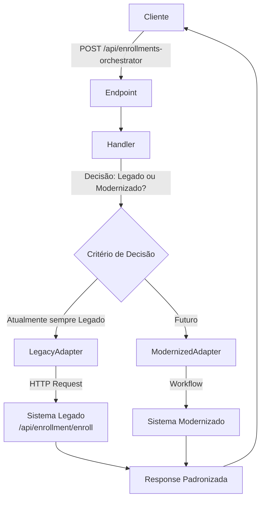

# EnrollmentOrchestrator - Camada de Mediação para Modernização

## 📋 Visão Geral

O **EnrollmentOrchestrator** é uma camada de mediação implementada no contexto de Orchestration que permite a convivência entre o sistema legado e o sistema modernizado durante o processo de estrangulamento do código legacy.

## 🎯 Objetivo

Criar um ponto único de entrada para processamento de novas inscrições que decide automaticamente qual sistema utilizar (legado ou modernizado) baseado em critérios configuráveis.

## 🏗️ Arquitetura

### Vertical Slice Architecture

```
Domain/Orchestration/Features/EnrollmentOrchestrator/
├── Endpoint.cs              # FastEndpoints endpoint (/api/enrollments-orchestrator)
├── Handler.cs               # Lógica de decisão entre legado/modernizado
├── Request.cs               # Modelo de entrada
├── Response.cs              # Modelo de saída
├── Configuration.cs         # Configurações do orchestrator
├── LegacyAdapter.cs         # Adaptador HTTP para sistema legado
└── ModernizedAdapter.cs     # Adaptador para sistema modernizado (futuro)
```

## 🔄 Fluxo de Funcionamento



## 📦 Componentes

### 1. Endpoint.cs

**Rota**: `POST /api/enrollments-orchestrator`  
**Responsabilidade**: Receber requisições de nova inscrição e delegar ao Handler

```csharp
public class Endpoint : Endpoint<Request, Response>
{
    private readonly Handler _handler;

    public override void Configure()
    {
        Post("/api/enrollments-orchestrator");
        AllowAnonymous();
        Tags("Orchestration");
    }

    public override async Task HandleAsync(Request req, CancellationToken ct)
    {
        var result = await _handler.HandleAsync(req);
        if (result.IsFailure)
        {
            await SendErrorsAsync(cancellation: ct);
            return;
        }
        await SendOkAsync(result.Value, ct);
    }
}
```

### 2. Handler.cs

**Responsabilidade**: Decidir qual sistema usar baseado em critérios

```csharp
public class Handler
{
    private readonly LegacyAdapter _legacyAdapter;
    private readonly ModernizedAdapter _modernizedAdapter;

    public async Task<Result<Response>> HandleAsync(Request request)
    {
        // TODO: Implementar lógica de decisão baseada em critérios futuros
        // Por enquanto, sempre usa o sistema legado
        var useLegacySystem = true;

        if (useLegacySystem)
        {
            var result = await _legacyAdapter.ProcessEnrollmentAsync(request);
            if (result.IsFailure)
                return Result.Failure<Response>(result.Error);

            return Result.Success(new Response(result.Value, "Legacy"));
        }
        else
        {
            var result = await _modernizedAdapter.ProcessEnrollmentAsync(request);
            if (result.IsFailure)
                return Result.Failure<Response>(result.Error);

            return Result.Success(new Response(result.Value, "Modernized"));
        }
    }
}
```

### 3. LegacyAdapter.cs

**Responsabilidade**: Chamar o sistema legado via HTTP

**Características**:
- ✅ Timeout configurável (5 minutos)
- ✅ Tratamento de erros HTTP
- ✅ Mapeamento de DTOs para formato legado
- ⏳ Retry policy (planejado)

```csharp
public class LegacyAdapter
{
    private readonly LegacyApiConfiguration _configuration;

    public async Task<Result<Guid>> ProcessEnrollmentAsync(Request request)
    {
        // Mapeia Request para formato legado
        var legacyRequest = new LegacyEnrollmentRequest { ... };

        // Chama API legada
        var response = await _configuration.BaseUrl
            .AppendPathSegment("api/enrollment/enroll")
            .WithTimeout(_configuration.TimeoutSeconds)
            .PostJsonAsync(legacyRequest)
            .ReceiveJson<LegacyEnrollmentResponse>();

        return Result.Success(response.EnrollmentId);
    }
}
```

### 4. ModernizedAdapter.cs

**Responsabilidade**: Chamar o sistema modernizado (futuro)

**Status**: 🚧 Planejado - atualmente retorna erro indicando indisponibilidade

```csharp
public class ModernizedAdapter
{
    public async Task<Result<Guid>> ProcessEnrollmentAsync(Request request)
    {
        // TODO: Implementar chamada para o workflow modernizado quando aprovado
        return Result.Failure<Guid>("Sistema modernizado ainda não está disponível");
    }
}
```

## ⚙️ Configuração

### appsettings.json

```json
{
  "LegacyApi": {
    "BaseUrl": "http://localhost:5000",
    "TimeoutSeconds": 300,
    "RetryAttempts": 3
  }
}
```

### Registro no DI (OrchestrationModule.cs)

```csharp
// Registra o EnrollmentOrchestrator
builder.RegisterType<LegacyAdapter>().AsSelf().InstancePerLifetimeScope();
builder.RegisterType<ModernizedAdapter>().AsSelf().InstancePerLifetimeScope();
builder.RegisterType<Handler>().AsSelf().InstancePerLifetimeScope();
builder.RegisterType<Endpoint>().AsSelf().InstancePerLifetimeScope();
```

### Configuração no Program.cs

```csharp
.Configure<LegacyApiConfiguration>(builder.Configuration.GetSection("LegacyApi"))
```

## 📝 Modelos de Dados

### Request

```csharp
public record Request
{
    public Guid ClientId { get; set; }
    public Guid PlanId { get; set; }
    public DateTime StartDate { get; set; }
    public DateTime EndDate { get; set; }
    public StudentDto Student { get; set; }
    public PhysicalAssessmentDto PhysicalAssessment { get; set; }
}
```

### Response

```csharp
public record Response(Guid EnrollmentId, string ProcessingSystem);
```

- `EnrollmentId`: ID da inscrição criada
- `ProcessingSystem`: "Legacy" ou "Modernized"

## 🔍 Critérios de Decisão

### Atual

- **Sempre usa sistema legado** (`useLegacySystem = true`)

### Futuros (Planejados)

Possíveis critérios para decisão automatizada:

1. **Por Tenant**: Alguns tenants usam legado, outros modernizado
2. **Por Tipo de Plano**: Planos específicos testam o sistema modernizado
3. **Por Percentual**: Rollout gradual (ex: 10% modernizado, 90% legado)
4. **Por Feature Flag**: Controle externo via feature toggles
5. **Por Horário**: Testes em horários de baixo tráfego
6. **Por Região**: Rollout por região geográfica

## 🚀 Como Usar

### Exemplo de Requisição

```http
POST /api/enrollments-orchestrator
Content-Type: application/json

{
  "clientId": "3fa85f64-5717-4562-b3fc-2c963f66afa6",
  "planId": "3fa85f64-5717-4562-b3fc-2c963f66afa7",
  "startDate": "2025-10-01T00:00:00Z",
  "endDate": "2025-11-01T00:00:00Z",
  "student": {
    "name": "João da Silva Santos",
    "email": "joao.silva@email.com",
    "phone": "11999999999",
    "document": "12345678901",
    "birthDate": "1990-01-01T00:00:00Z",
    "gender": "M",
    "address": "Rua das Flores, 123"
  },
  "physicalAssessment": {
    "personalId": "3fa85f64-5717-4562-b3fc-2c963f66afa8",
    "assessmentDate": "2025-10-02T00:00:00Z",
    "weight": 80.5,
    "height": 175.0,
    "bodyFatPercentage": 15.0,
    "notes": "Primeira avaliação física"
  }
}
```

### Exemplo de Resposta (Sucesso)

```json
{
  "enrollmentId": "3fa85f64-5717-4562-b3fc-2c963f66afa9",
  "processingSystem": "Legacy"
}
```

### Exemplo de Resposta (Erro)

```json
{
  "errors": {
    "GeneralErrors": [
      "Erro ao processar inscrição no sistema legado: Plano não encontrado"
    ]
  }
}
```

## 🎯 Estratégia de Modernização

### Fase 1: Implementação (Atual) ✅

- [x] Criar EnrollmentOrchestrator
- [x] Implementar LegacyAdapter
- [x] Configurar roteamento para legado
- [x] Adicionar logging e monitoramento

### Fase 2: Validação 🚧

- [ ] Testes de integração
- [ ] Testes de carga
- [ ] Validação de timeout e retry
- [ ] Documentação de APIs

### Fase 3: Transição Gradual ⏳

- [ ] Implementar ModernizedAdapter
- [ ] Definir critérios de decisão
- [ ] Implementar feature flags
- [ ] Rollout gradual (10% → 50% → 100%)

### Fase 4: Finalização 📅

- [ ] Migração completa para modernizado
- [ ] Deprecar sistema legado
- [ ] Remover LegacyAdapter
- [ ] Atualizar documentação

## 📊 Monitoramento

### Logs Estruturados

```csharp
_logger.LogInformation("Processing enrollment via {System}", "Legacy");
_logger.LogError(ex, "Failed to process enrollment via {System}", "Legacy");
```

### Métricas Recomendadas

- **Taxa de sucesso** por sistema (Legacy vs Modernized)
- **Tempo de resposta** por sistema
- **Erros** por tipo e sistema
- **Volume de requisições** por sistema
- **Distribuição de decisões** (quantas vão para cada sistema)

## 🛡️ Tratamento de Erros

### Erros do Sistema Legado

- **Timeout**: Erro após 5 minutos
- **HTTP 400**: Dados inválidos
- **HTTP 500**: Erro interno do legado
- **Conexão**: Falha de rede

### Erros do Sistema Modernizado

- **Indisponibilidade**: Sistema ainda não aprovado
- **Workflow**: Erros no WorkflowCore
- **Validação**: Erros de business rules

## 🔐 Segurança

- **Autenticação**: AllowAnonymous (configurar autenticação quando necessário)
- **Autorização**: Implementar políticas de acesso
- **Validação**: Validar dados de entrada
- **Rate Limiting**: Configurar limites de requisições

## 📚 Referências

- [Strangler Fig Pattern](https://martinfowler.com/bliki/StranglerFigApplication.html)
- [Vertical Slice Architecture](https://www.jimmybogard.com/vertical-slice-architecture/)
- [FastEndpoints Documentation](https://fast-endpoints.com/)
- [Result Pattern with CSharpFunctionalExtensions](https://github.com/vkhorikov/CSharpFunctionalExtensions)

## 📝 Notas Importantes

1. **NewEnrollmentFlow Preservado**: O workflow existente não foi alterado, conforme solicitado
2. **Timeout Configurável**: 5 minutos para suportar operações longas do legado
3. **Retry Policy**: Planejado para implementação futura
4. **Feature Flags**: Recomendado para controle de rollout
5. **Observabilidade**: Implementar métricas e tracing distribuído

---

**Data de Criação**: 2025-10-01  
**Última Atualização**: 2025-10-01  
**Status**: ✅ Implementado e funcionando  
**Responsável**: GymErp Team

