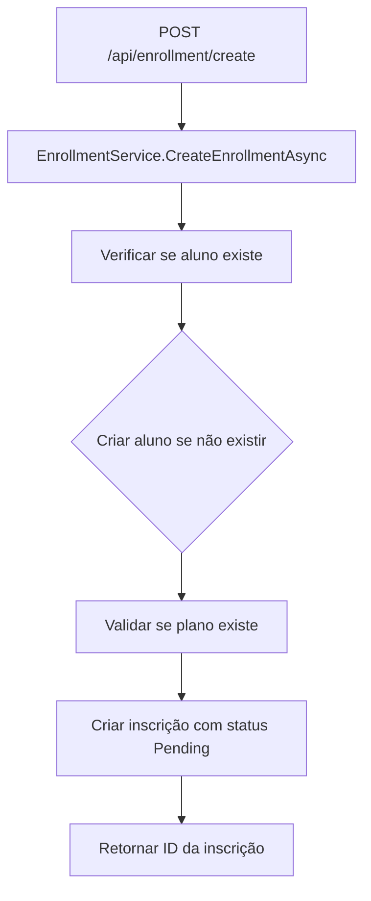
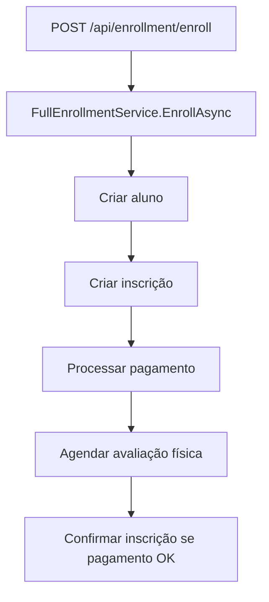

# Novo Endpoint de Inscrições - Sistema Legado

## 📋 Resumo da Funcionalidade

Foi implementado um novo endpoint de inscrições no sistema legado (`legacy/gym_erp`) que permite criar inscrições de forma simplificada, mantendo o endpoint original para retrocompatibilidade.

## 🎯 Objetivo

- **Separar responsabilidades**: Criar inscrições sem processar pagamento e avaliação física
- **Flexibilidade**: Permitir criação de inscrições em etapas separadas
- **Retrocompatibilidade**: Manter endpoint original funcionando normalmente

## 🚀 Endpoints Disponíveis

### 1. Novo Endpoint - Criação Simples de Inscrição
```
POST /api/enrollment/create
```

**Payload:**
```json
{
  "student": {
    "name": "João da Silva Santos",
    "email": "joao.silva@email.com",
    "phone": "11999999999",
    "document": "12345678901",
    "birthDate": "1990-01-01T00:00:00Z",
    "gender": 0,
    "address": "Rua das Flores, 123"
  },
  "planId": "550e8400-e29b-41d4-a716-446655440000",
  "startDate": "2024-01-01T00:00:00Z",
  "endDate": "2024-12-31T23:59:59Z"
}
```

**Response:**
```json
{
  "enrollmentId": "550e8400-e29b-41d4-a716-446655440001"
}
```

**Características:**
- ✅ Cria apenas a inscrição (status: `Pending`)
- ✅ Cria aluno se não existir
- ✅ Valida se o plano existe
- ❌ Não processa pagamento
- ❌ Não agenda avaliação física

### 2. Endpoint Original - Processo Completo (Retrocompatibilidade)
```
POST /api/enrollment/enroll
```

**Payload:**
```json
{
  "student": {
    "name": "João da Silva Santos",
    "email": "joao.silva@email.com",
    "phone": "11999999999",
    "document": "12345678901",
    "birthDate": "1990-01-01T00:00:00Z",
    "gender": 0,
    "address": "Rua das Flores, 123"
  },
  "planId": "550e8400-e29b-41d4-a716-446655440000",
  "startDate": "2024-01-01T00:00:00Z",
  "endDate": "2024-12-31T23:59:59Z",
  "physicalAssessment": {
    "personalId": "550e8400-e29b-41d4-a716-446655440002",
    "assessmentDate": "2024-01-02T10:00:00Z",
    "weight": 75.5,
    "height": 175.0,
    "bodyFatPercentage": 15.0,
    "notes": "Cliente em boa forma física"
  }
}
```

**Características:**
- ✅ Processo completo de matrícula
- ✅ Processa pagamento automaticamente
- ✅ Agenda avaliação física
- ✅ Confirma inscrição se pagamento for aprovado

## 🏗️ Arquitetura Implementada

### Novos Componentes Criados

#### 1. Interface de Serviço
```csharp
// Gymerp.Application/Interfaces/IEnrollmentService.cs
public interface IEnrollmentService
{
    Task<Guid> CreateEnrollmentAsync(EnrollmentDto dto);
}
```

#### 2. Implementação do Serviço
```csharp
// Gymerp.Application/Services/EnrollmentService.cs
public class EnrollmentService : IEnrollmentService
{
    // Apenas cria inscrição sem pagamento/avaliação
    public async Task<Guid> CreateEnrollmentAsync(EnrollmentDto dto)
}
```

#### 3. Endpoint no Controller
```csharp
// Gymerp.Api/Controllers/EnrollmentController.cs
[HttpPost("create")]
public async Task<IActionResult> CreateEnrollment([FromBody] EnrollmentDto dto)
```

### Componentes Reutilizados

- **EnrollmentDto**: DTO existente (mais simples que FullEnrollmentDto)
- **Repositórios**: StudentRepository, PlanRepository, EnrollmentRepository
- **Entidades**: Student, Plan, Enrollment (domínio existente)

## 🔧 Configuração

### Dependency Injection
```csharp
// Program.cs
builder.Services.AddScoped<IEnrollmentService, EnrollmentService>();
```

### Registros Necessários
- ✅ `IStudentRepository` → `StudentRepository`
- ✅ `IPlanRepository` → `PlanRepository`  
- ✅ `IEnrollmentRepository` → `EnrollmentRepository`

## 📊 Fluxo de Funcionamento

### Novo Endpoint (`/create`)


### Endpoint Original (`/enroll`)


## 🎯 Casos de Uso

### Quando usar `/create`
- ✅ Criação de inscrições em etapas separadas
- ✅ Integração com sistemas externos que processam pagamento separadamente
- ✅ Workflows onde pagamento é processado posteriormente
- ✅ Testes e desenvolvimento

### Quando usar `/enroll`
- ✅ Processo completo de matrícula
- ✅ Aplicações que precisam de tudo pronto imediatamente
- ✅ Sistemas legados que já usam este endpoint

## ⚠️ Considerações Importantes

### Status da Inscrição
- **Novo endpoint**: Status inicial `Pending`
- **Endpoint original**: Status `Active` (se pagamento aprovado)

### Validações
- ✅ Ambos validam se o plano existe
- ✅ Ambos criam aluno se não existir
- ❌ Apenas `/enroll` valida disponibilidade do personal para avaliação

### Tratamento de Erros
- ✅ Ambos retornam `400 BadRequest` para dados inválidos
- ✅ Ambos retornam `200 OK` com ID da inscrição em caso de sucesso

## 🚀 Como Testar

### 1. Teste do Novo Endpoint
```bash
curl -X POST "https://localhost:7001/api/enrollment/create" \
  -H "Content-Type: application/json" \
  -d '{
    "student": {
      "name": "João da Silva Santos",
      "email": "joao.silva@email.com",
      "phone": "11999999999",
      "document": "12345678901",
      "birthDate": "1990-01-01T00:00:00Z",
      "gender": 0,
      "address": "Rua das Flores, 123"
    },
    "planId": "550e8400-e29b-41d4-a716-446655440000",
    "startDate": "2024-01-01T00:00:00Z",
    "endDate": "2024-12-31T23:59:59Z"
  }'
```

### 2. Teste do Endpoint Original
```bash
curl -X POST "https://localhost:7001/api/enrollment/enroll" \
  -H "Content-Type: application/json" \
  -d '{
    "student": {
      "name": "João da Silva Santos",
      "email": "joao.silva@email.com",
      "phone": "11999999999",
      "document": "12345678901",
      "birthDate": "1990-01-01T00:00:00Z",
      "gender": 0,
      "address": "Rua das Flores, 123"
    },
    "planId": "550e8400-e29b-41d4-a716-446655440000",
    "startDate": "2024-01-01T00:00:00Z",
    "endDate": "2024-12-31T23:59:59Z",
    "physicalAssessment": {
      "personalId": "550e8400-e29b-41d4-a716-446655440002",
      "assessmentDate": "2024-01-02T10:00:00Z",
      "weight": 75.5,
      "height": 175.0,
      "bodyFatPercentage": 15.0,
      "notes": "Cliente em boa forma física"
    }
  }'
```

## 📝 Conclusão

A implementação foi concluída com sucesso, mantendo a retrocompatibilidade e adicionando flexibilidade ao sistema legado. O novo endpoint permite criar inscrições de forma simplificada, enquanto o endpoint original continua funcionando normalmente para processos completos de matrícula.

### ✅ Benefícios Alcançados
- **Separação de responsabilidades**: Criação vs Processo completo
- **Flexibilidade**: Permite workflows em etapas
- **Retrocompatibilidade**: Sistema existente continua funcionando
- **Simplicidade**: Novo endpoint mais direto para casos específicos
