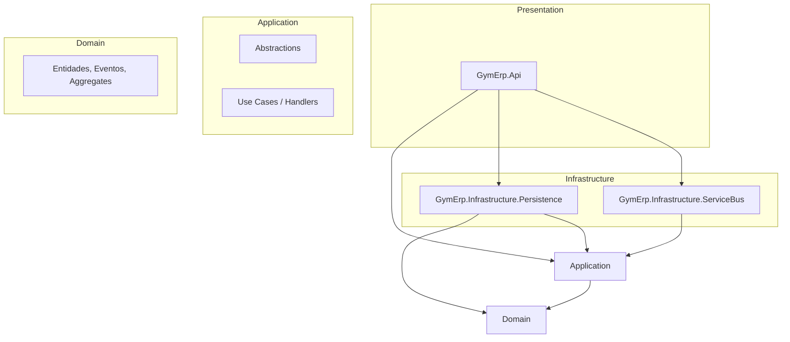

# GymErp — Clean Architecture

Este projeto segue **Clean Architecture** em .NET. O **Domain** contém regras de negócio puras; a **Application** executa casos de uso (handlers) orquestrando o domínio; **Infrastructure** e **Presentation** são detalhes (EF, HTTP, mensageria) plugados via interfaces definidas na Application.

---

## Camadas e responsabilidades

| Camada | Projeto(s) | Responsabilidade |
|--------|------------|-------------------|
| **Domain** | GymErp.Domain | Regras de negócio puras: entidades, value objects, eventos de domínio, agregados. Sem dependência de EF, ASP.NET, Kafka, etc. |
| **Application** | GymErp.Application | Casos de uso (handlers) que orquestram o domínio; define **abstrações** (interfaces) para persistência, mensageria, etc. Cada use case fica em `UseCases/<Feature>/` com interface, handler e DTOs. |
| **Infrastructure** | GymErp.Infrastructure.Persistence, GymErp.Infrastructure.ServiceBus | Implementa interfaces da Application com tecnologias concretas (EF, NoOp/Kafka). |
| **Presentation / UI** | GymErp.Api | Entry point: adapta HTTP para comandos/requests e chama a Application. |

---

## Regra de dependências

A dependência sempre aponta **para dentro** (em direção ao Domain):

- **Domain**: nenhuma referência a outros projetos da solution; apenas pacotes de biblioteca (ex.: CSharpFunctionalExtensions).
- **Application**: referência apenas a **Domain**; define as abstrações (interfaces) que a Infrastructure implementa e as interfaces dos use cases.
- **Infrastructure**: referências apenas a **Application** (e, quando necessário, Domain para tipos de entidade nos repositórios).
- **GymErp.Api**: referência **Application** e os projetos de **Infrastructure**; não referencia Domain diretamente (uso apenas via Application).

**Não fazer:**

- Domain não deve referenciar Application ou Infrastructure.
- Application não deve referenciar Infrastructure.
- Api não deve referenciar Domain diretamente; apenas via Application.

---

## Diagrama de dependências (Clean Architecture)

Resumo: **Domain** no centro; **Application** orquestra e define abstrações; **Infrastructure** implementa essas abstrações; **Api** é o entry point que monta comandos e chama a Application.

---

## Use cases (Application)

| Interface | Descrição | Handler |
|-----------|-----------|---------|
| `IAddNewEnrollmentUseCase` | Nova inscrição | `AddNewEnrollmentHandler` |
| `ICancelEnrollmentUseCase` | Cancelar inscrição | `CancelEnrollmentHandler` |
| `ISuspendEnrollmentUseCase` | Suspender inscrição | `SuspendEnrollmentHandler` |

As interfaces dos use cases ficam em `UseCases/<Feature>/` junto do handler. A Presentation (Api) chama essas interfaces.

## Abstrações (Application)

Interfaces que a Application define e a Infrastructure implementa:

| Interface | Descrição |
|-----------|-----------|
| `IEnrollmentRepository` | Persistência de inscrições (add, get, update) |
| `IUnitOfWork` | Transação / commit |
| `IEventPublisher` | Publicação de eventos de domínio |

Ficam na pasta `Abstractions/` do projeto Application.

---

## Onde estão as implementações (Infrastructure)

| Adapter | Projeto | Implementação |
|---------|---------|---------------|
| **HTTP** | GymErp.Api | Controllers montam comandos/requests e chamam as interfaces dos use cases |
| **Persistência** | GymErp.Infrastructure.Persistence | `EnrollmentRepository`, `UnitOfWork`, `SubscriptionsDbContext` (EF) |
| **Eventos** | GymErp.Infrastructure.ServiceBus | `NoOpEventPublisher` (hoje no-op; no futuro Kafka/Rabbit) |

Os eventos de domínio são despachados pela camada de persistência após `SaveChanges` (em `ServiceBusExtensions`), usando `IEventPublisher`; a Application não conhece o momento exato da publicação.

---

## Composition Root

Todo o registro é feito no **Program.cs** do projeto **GymErp.Api**:

- `AddApplication()` — registra use cases e handlers (Application).
- `AddPersistence(config)` — DbContext, `IEnrollmentRepository`, `IUnitOfWork`.
- `AddEventPublisher()` — `IEventPublisher` → `NoOpEventPublisher`.

---

## Estrutura da solution

- **GymErp.Domain** — entidades, eventos de domínio, agregados (`Common`: `IDomainEvent`, `Aggregate`); pasta `Enrollments/` com entidades e states.
- **GymErp.Application** — **Abstractions/** (interfaces `IEnrollmentRepository`, `IUnitOfWork`, `IEventPublisher`) e **UseCases/** (cada feature com interface do use case, handler e DTOs).
- **GymErp.Infrastructure.Persistence** — implementações EF (repositório, UoW, DbContext, dispatching de domain events).
- **GymErp.Infrastructure.ServiceBus** — implementação de publicação de eventos (NoOp; futuramente Kafka).
- **GymErp.Api** — host HTTP e Composition Root (Presentation).
