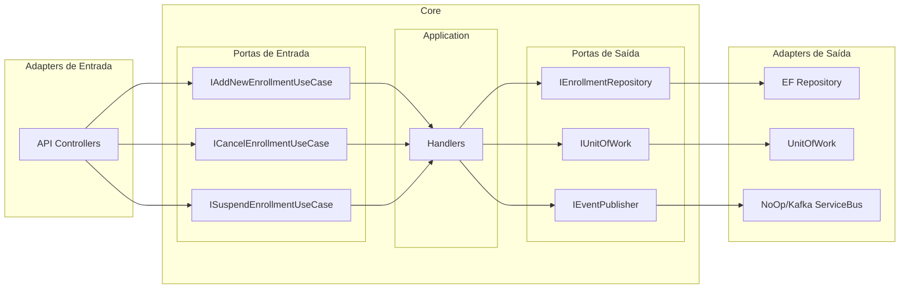

# GymErp — Arquitetura Hexagonal (Ports & Adapters)

Este projeto segue a **Arquitetura Hexagonal**: o Core (Domain + Application) define **portas** (contratos) e os **adapters** (API, Persistence, ServiceBus) implementam ou consomem essas portas. O **Composition Root** fica no `Program.cs` do host (GymErp.Api), onde os adapters são registrados e “plugados” nas portas.

## Visão da arquitetura

- **Portas de entrada**: como o mundo chama o sistema (use cases).
- **Portas de saída**: o que o Core precisa do mundo (repositório, UoW, publicação de eventos).
- **Adapters**: implementações concretas (HTTP, EF, NoOp/Kafka); só o host referencia e registra.

## Portas de entrada (Use Cases)

| Interface | Descrição | Handler |
|-----------|-----------|---------|
| `IAddNewEnrollmentUseCase` | Nova inscrição | `AddNewEnrollmentHandler` |
| `ICancelEnrollmentUseCase` | Cancelar inscrição | `CancelEnrollmentHandler` |
| `ISuspendEnrollmentUseCase` | Suspender inscrição | `SuspendEnrollmentHandler` |

## Portas de saída (Outbound)

| Interface | Descrição |
|-----------|-----------|
| `IEnrollmentRepository` | Persistência de inscrições (add, get, update) |
| `IUnitOfWork` | Transação / commit |
| `IEventPublisher` | Publicação de eventos de domínio |

## Onde estão os Adapters

| Adapter | Projeto | Implementação |
|---------|---------|---------------|
| **Entrada (HTTP)** | GymErp.Api | Controllers chamam os use cases |
| **Saída (persistência)** | GymErp.Infrastructure.Persistence | `EnrollmentRepository`, `UnitOfWork`, `SubscriptionsDbContext` (EF) |
| **Saída (eventos)** | GymErp.Infrastructure.ServiceBus | `NoOpEventPublisher` (hoje no-op; no futuro Kafka/Rabbit) |

## Composition Root

Todo o registro de adapters e use cases é feito no **Program.cs** do projeto **GymErp.Api**:

- `AddApplication()` — registra use cases e handlers (Core).
- `AddPersistence(config)` — DbContext, `IEnrollmentRepository`, `IUnitOfWork`.
- `AddEventPublisher()` — `IEventPublisher` → `NoOpEventPublisher`.

Nenhum outro projeto registra implementações de repositório ou message bus; apenas o host.

## Regra de ouro

Se é possível **trocar a tecnologia** (SendGrid ↔ SES, Kafka ↔ Rabbit, EF ↔ Dapper) e o **Core (Application + Domain) não muda**, então aquilo é **Adapter**.

## Estrutura da solution

- **GymErp.Domain** — entidades, eventos de domínio, agregados (`Common`: `IDomainEvent`, `Aggregate`).
- **GymErp.Application** — portas **Inbound** (`Ports/Inbound`: use cases), portas **Outbound** (`Ports/Outbound`: repositório, UoW, event publisher) e implementações dos use cases em `UseCases/`.
- **GymErp.Infrastructure.Persistence** — adapter EF (repositório, UoW, DbContext).
- **GymErp.Infrastructure.ServiceBus** — adapter de publicação de eventos (NoOp; futuramente Kafka).
- **GymErp.Api** — host HTTP e Composition Root.
